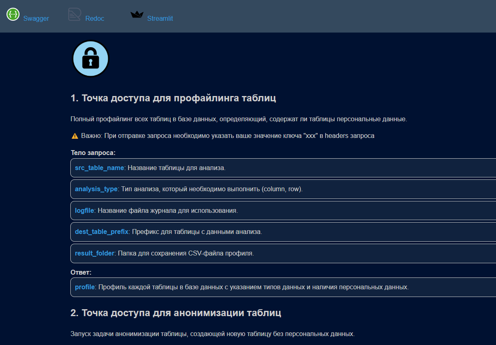

# ℹ️ Описание АПИ
## Профайлинг таблиц базы данных

Каждая таблица анализируется на предмет наличия персональных данных. 

Алгоритм анализа:
- определяется тип для каждого столбца
- столбец, содержащий текст, анализируется на предмет наличия персональных данных с помощью МЛ-модели,
все найденные типы персональных данных помечаются в таблице
- столбцы, содержащие даты, помечаются соответствующим образом
- столбцы, содержащие числа, помечаются как чувствительные если не являются ключами

## Настройки анонимизации

Настройки анонимизации задаются в виде JSON-файла. Пример настроек:
```json
{
  "rf_regions":{
        "columns":[
                "family",
                "name",
                "surname"
        ]
        "strategy":{
                "family":"SENSITIVE",
                "name":"LOC",
                "surname":"LOC"
        }
        "prefix":"anonymized"
        }
  "addresses":{
        "columns":[
                "family",
                "name",
                "surname",
                "birthdate"
        ]
        "strategy":{
                "family":"SENSITIVE",
                "name":"LOC",
                "surname":"SENSITIVE",
                "birthdate":"SENSITIVE"
        }
        "prefix":"anonymized"
        }
}
```

## Описание стратегий анонимизации

- SENSITIVE - генерация случайного числа
- LOC - генерация случайного города
- DATE - генерация случайной даты
- PHONE - генерация случайного телефона
- EMAIL - генерация случайного email
- URL - генерация случайного URL
- PER - генерация случайного имени
- ORG - генерация случайного названия организации
- TEXT - анализ текста с помощью МЛ-модели и замена всех найденных персональных данных на плейсхолдеры

## Принцип работы генератора

Генератор обеспечивает консистентность анонимизации данных. Для этого он использует хэш-функцию от исходных данных и настроек анонимизации.

После анонимизации данных, генератор сохраняет хэш-функцию вместе с анонимизированными данными. 

При необходимости можно сбросить буфер генератора или включить принудительную очистку буфера при анонимизации новых данных.

## Установка

Для установки необходимо
- установить Docker и Docker-compose
- склонировать репозиторий
- заполнить файл .env.example и переименовать его в .env
- выполнить команду `docker-compose up --build`


## АПИ

API будет доступно по адресу http://localhost где можно найти документацию по основным эндпоинтам.
Также здесь будут ссылки на UI, swagger и redoc.

Скриншоты API:
<details>


</details>

## UI

UI будет доступен по адресу http://localhost:8505

Через UI можно выполнить профайлинг таблиц, настроить конфиг и запустить анонимизацию данных.

Кроме того, в UI можно просмотреть результаты анонимизации и скачать анонимизированные данные.

Скриншоты UI:

<details>


</details>
